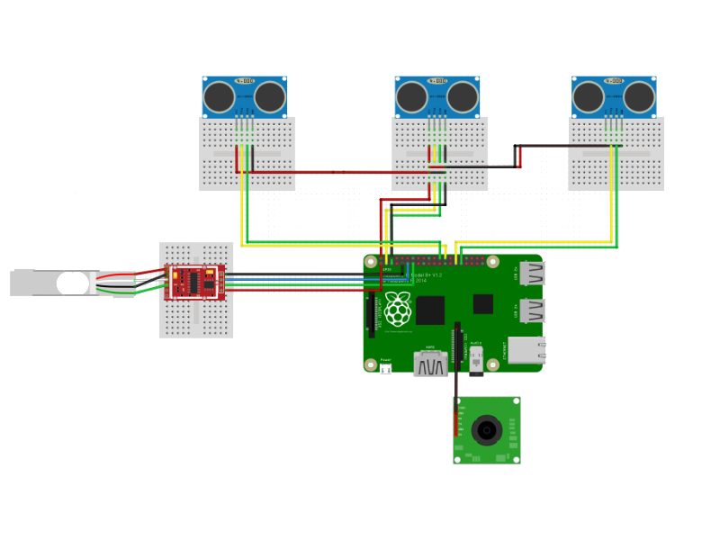

Image Processing Living Intelligence_Hardware
------

This is a repository for Hardware module of Image Processing Living Intelligence. 

This project requires a **subnet** configuration between the server, the hardware and the Android module. 

### **Requirements** 

* H/W
  * RaspberryPi 3 b+
  * HC-SR04
  * Picamera 8mp v2
  * Road cell hx711
  * Road cell ADC

* S/W
  * Raspbian buster with desktop
  * Python 3.7
  * MJPG Streamer

1. 라즈비안 이미지 굽기
https://edw216.github.io/rasp/
2. 파이썬 3.7버전 다운로드
https://edw216.github.io/rasp/
3. 파이카메라 초기설정
 * 라즈베리파이 터미널 창에서 `sudo raspi-config` 명령어를 입력한다. 
 * Interfacing Options 항목선택 
 * Camera 항목 선택 
 * enabled 선택 후 확인  
 * raspi-config 창으로 돌아와서 finish 선택 후 reboot 를 실행한다. 
 * 터미널 창을 키고 `raspistill -o test.jpg` 명령어를 통해 카메라 테스트를 확인한다.  

### **Raspbian Autostart** 

**1.실행 가능한 파이썬 스크립트 생성**

`sudo nano /home/pi/start.sh`

파일에 아래와 같이 적은 후 저장한다.
`#! /bin/sh
sudo lxterminal command="python3  /home/pi/파이썬폴더/실행 할 파이썬파일.py"`

다시 sh파일이 저장한 경로로 이동하여

`cd /home/pi`

실행가능하게 등록해준다.

`sudo chmod +x start.sh`

**2. autostart에 등록**

`sudo nano /etc/xdg/lxsession/LXDE-pi/autostart`

맨 마지막 줄에 sh파일의 경로를 적어준다.

`@/home/pi/start.sh`

**3. profile 직접 수정**

위의 경우(1 ,2)가 안될 시 `sudo nano /etc/profile` 입력한다. 

맨끝 fi 뒤에 실행하고자 하는 명령어를 추가한다. 
   
스크립트가 파이썬일 때 `python /home/pi/start.py` 입력한다. 
   
스크립트가 쉘일 때 `./home/pi/start.sh` 입력한다.  
   
Autostart 가 실행되는지 터미널 창에 `sudo reboot` 입력. 

### **How to communicate with the Server** 
C로 작성되어져 있는 서버와 같은 서브넷망으로 구성된 무선랜에 연결하여 서버와 tcp/ip 소켓통신을 통해 스트링 데이터를 주고 받는다. 

### **How it works** 
카트에 부착되어진 초음파 거리 센서는 일정 범위 안에 들어오는 물체를 인식한다. 즉, 사용자가 카트에 상품을 넣게 되면 초음파 거리 센서는 물체가 카트 안에 들어옴을 인지 한 뒤 카트의 ip를 사용해 mjpgestreamer 이미지 스트리밍 서버를 생성한다. 카트 클라이언트는 서버에게 카메라 스트리밍을 시작한다는 `tmpStr = 'darknet.exe detector demo data/obj.data data/yolo-obj.cfg yolo-obj_last.weights http://'+my_ip+':8091/?action=stream'` 해당 스트링 데이터를 서버에게 전송 한다. 스트링 데이터를 전송받은 서버는 카트가 생성한 서버에 접속한 뒤, 스트리밍 데이터를 받는다. 서버에 의해 인식된 물체가 카트위에 놓여지면 카트 밑에 부착된 로드셀은 무게의 증감을 판단하여 해당 증감 데이터를 서버에게 전송한다.

### **Wiring Diagram** 

Usage
------
시연 영상 : [https://youtu.be/Cik78MP8W3E](https://youtu.be/Cik78MP8W3E)
관련 포스팅 : [https://ohjinjin.github.io/projects/IPLI/](https://ohjinjin.github.io/projects/IPLI/)
